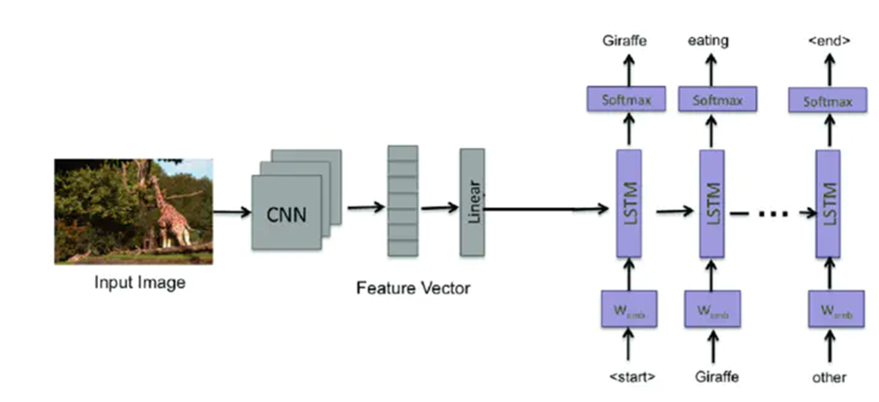
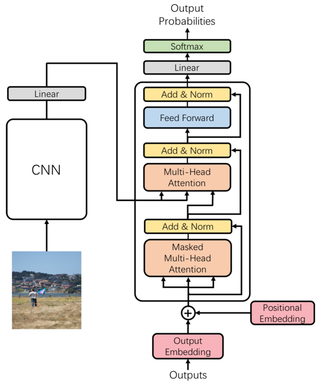
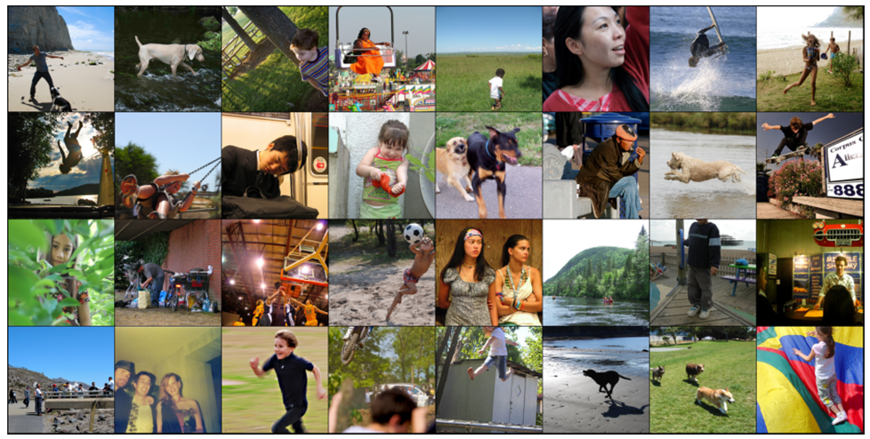
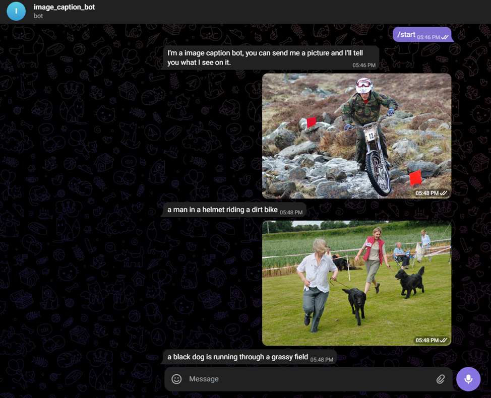

# Comparative Analysis of Transformer and CNN-RNN Architectures for Image Captioning

## Model description

### CNN-RNN Model

In this framework, a convolutional neural network (CNN) is used as an encoder to
extract visual features from images. The extracted features are then fed into a recurrent neural network
(RNN) which generates the captions sequentially. This approach is based on a pre-trained CNN from the ImageNet challenge, coupled with
a Long Short-Term Memory (LSTM) network to handle the sequence generation.

### Transformer Model

The next in comparison are transformer-based model, which utilize self-attention mechanisms to pro-
cess the entire image and caption sequence simultaneously.
This implementation adapts the transformer architecture for image captioning by treating image fea-
tures as a sequence of tokens, similar to how text is processed.

## Dataset details

For training and evaluating image captioning models, was utilized the Flickr8K dataset.
The Flickr8K dataset comprises 8,000 photographs sourced from the Flickr website. Each image in this dataset is accompanied by five different captions, which were written by human annotators.  
Below are a few examples of images from the Flickr8K dataset used in training process.

## BLUE-4 Comparsion

The following table summarizes the BLEU-4 scores achieved by each model on the test set of the Flickr8K dataset

|Model         | Embedding size | Hidden size | BLUE-4 |
|--------------|----------------|-------------|--------|
| CNN-RNN      |512             |1024         | 9.69   |
| Transformer  |512             |1024         | 11.24  |
| Transformer  |1024            |2048         | 15.05  |

## Telegram Bot

Telegram bot utilizes the model trained on the Flickr8K dataset to generate captions for images sent by users in a Telegram chat. 
The screenshot illustrates the bot’s response to an image, showcasing its ability to understand and describe the content of the image accurately.  

### How the Bot Works

- User Interaction: Users send images to the bot via the Telegram messaging platform.
- Image Processing: Upon receiving an image, the bot processes the image through the pre-trained image captioning model.
- Caption Generation: The model generates a caption based on the content it recognizes in the image.
- Display Result: The bot then sends this caption back to the user, providing a textual description of the image.  

### Screenshot Example

 
